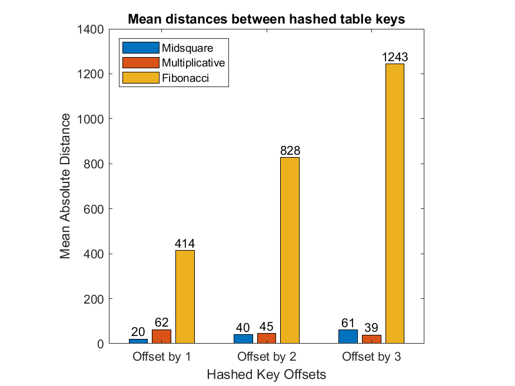
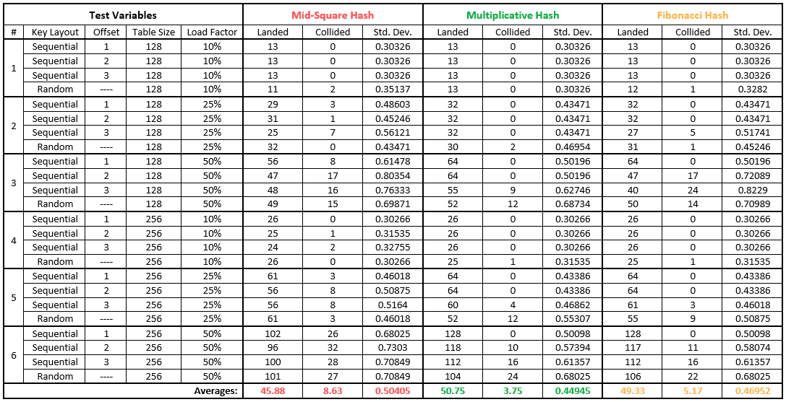

<h1>
  Hash Functions Evaluation
</h1>

This is part of the coursework for the Data Structures & Algorithms course in the third year of my Computer Science degree. There are two parts to the code for the evaluation:

- Testing the <a href="https://en.wikipedia.org/wiki/Avalanche_effect">avalanche property</a> for three hash functions
- Testing the key spread & collisions

The three hash functions used for these tests were:

### Fibonacci
```matlab
function hashedKey = fibonacci(key)

    goldenRatioR = (sqrt(5)-1)/2; % Reciprocal of the golden ratio.

    hashedKey = int64(key * ((2^8) / goldenRatioR));

end
```

### Mid Square
```matlab
function hashedKey = midsquare(key)

    keySquared = key * key;

    keyString = num2str(keySquared);

    keyLength = numel(keyString);

    midpoint = int8(keyLength/2);

    key = keyString(midpoint-1:midpoint+1);

    hashedKey = str2double(key);

end
```

### Multiplicative
```matlab
function hashedKey = multiplicative(key)

    goldenRatioR = (sqrt(5)-1)/2; % Reciprocal of the golden ratio.
    tableSize = 128;

    hashedKey = floor(tableSize * (goldenRatioR * key - floor(goldenRatioR * key)));

end
```

<br>

<h2 id="aims">
  Avalanche Property Evaluation
</h2>

The avalanche property is where keys that are close to each other are distributed to different areas of the hash table. This can reduce the number of potential collisions and make it harder to determine the original key from the hash. Testing if the three chosen hash functions possess this property is a great way to comparatively determine which hash functions may be more desirable to use.

<br>

<div align="center">
  
  <br>
  Figure 1: Mean absolute distances for each key offset to evaluate the avalanche property.
</div>

<br>

To evaluate the avalanche property, submitting similar keys into the hash functions and calculating the average distance between elements shows how dispersed these similar keys end up as they should not be close together if the avalanche property is to be fulfilled.
Looking at the results of <em>figure 1</em> above, there are three observations:

1. Mid-square increases by the distance of the first offset, but that distance is small
2. Multiplicative gradually decreases with minimal distance
3. Fibonacci increases by the distance of the first offset, but that distance is considerably more than Mid-square

These points show that the Fibonacci hash maintains great metrics to be considered viable for possessing the avalanche property, however, the mid-square and multiplicative hashes present poor prospects. Whilst the latter deteriorates quickly as the offset increases, it starts higher at the smallest offset, indicating a better distance for the avalanche property than mid-square.

<br>

<h2 id="plan">
  Key Spread & Collisions Evaluation
</h2>

After performing six tests with each key being sequentially offset and variations of random keys, the results are presented in <em>figure 2</em> below. The results show the number of hashes that landed successfully and the number of collisions, along with the standard deviation to determine the evenness of hash distribution.

<br>

<div align="center">
  
  <br>
  Figure 2: Hash function test results
</div>

<br>

Analysing these results, the multiplicative hash had the lowest average collisions, which meant values were distributed enough that overlaps on the index did not occur as often. It also maintained the lowest standard deviation, so values were reasonably spread in comparison to the other two hashes. Mid-square performed the worst with more average collisions than even Fibonacci, where the standard deviation peaked at 0.8, very poor.

The graphs for each test can be found <a href="key-spread-and-collisions/tests">here</a> for a more visual understanding of the data, however; a couple of interesting graphs have been included here for further evaluation.

<br>

<div align="center">
  
  <br>
  Figure 3: Results for test 2 mid-square with a sequential offset of 3
</div>

<br>

<div align="center">
  
  <br>
  Figure 4: Results for test 3 multiplicative with a sequential offset of 1
</div>

<br>

The mid-square hash loaded at 25% with an offset of three seen in <em>figure 3</em> was notable as it struggled with an extremely uneven distribution of keys. The tests around it also produced vaguely equivalent results, showing that the mid-square is not particularly good in comparison to the other hashes evaluated.

The multiplicative hash loaded at 50% with an offset of one seen in <em>figure 4</em> performed exceptionally well for the load factor and tight offset with no collisions and evenly distributed keys. This is by far the best performance out of all the tests.
